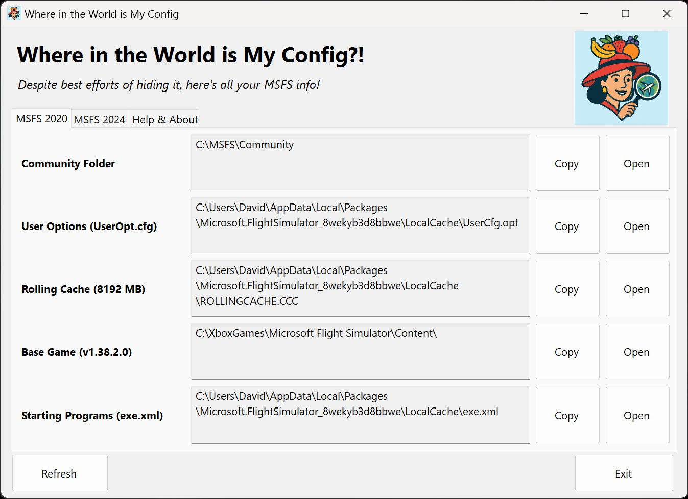

# MSFS - Where in the World is My Config??

A Windows application that locates and displays configuration paths for Microsoft Flight Simulator (MSFS 2020 and MSFS 2024).

## Features

- **Configuration Detection**: Community folders, user options, rolling cache, base game installation, and starting programs
- **MSFS Version Support**: Both MSFS 2020 and MSFS 2024 with automatic detection
- **Storage Report**: Find out where all your disk space has gone!
- **Installation Types**: Microsoft Store/Xbox Game Pass and Steam installations, with versions and sizes
- **User Interface**: Tabbed interface with copy/open buttons and DPI-aware scaling
- **Smart Detection**: Handles UWP protected locations and junction/symbolic links

## 📦 Installation

Download the latest release and run the executable. No installation required. See the 'Releases' section [HERE](https://github.com/fearlessfrog/MSFS_WhereintheWorldisMyConfig/releases).

## Usage

1. Launch the application
2. Navigate between tabs (MSFS 2020, MSFS 2024, Help & About)
3. Use Copy/Open buttons to interact with paths
4. Click Refresh to re-scan configurations

## ⭐ NEW!

What is your MSFS Animal? Let's found out in the new 'Stats & Stuff' tab. (yes I *know* this is kinda dumb but I enjoyed it)

## 🔧 Configuration Detection

Automatically detects MSFS installations from:
- Microsoft Store/Xbox Game Pass (UWP)
- Steam installations
- Custom locations in UserCfg.opt files

## 🐛 Troubleshooting

- **"Not Found" for Base Game**: May indicate UWP installation in protected location
- **"Disabled" Rolling Cache**: Configuration not found or explicitly disabled
- **Missing Configurations**: Check if MSFS is properly installed
- **Debug Information**: Enable debug logging via logo click in Help & About tab

## 🤝 Support & Feedback

This is an initial release that I use myself. While there's no formal support, I'm interested in feedback and bug reports.

## ⚖️ License & Disclaimer

This free software is provided "as is" without warranty. For educational/entertainment purposes only. Users are responsible for compliance and assume all risks.
